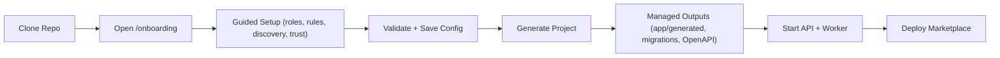
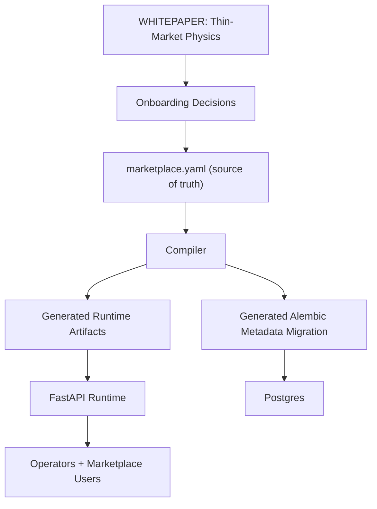

# Cosolvent

**Cosolvent is a marketplace compiler for thin markets.**  
It helps founders launch a deployable marketplace backend when supply and demand exist, but trades still fail because matching is hard, trust is low, information is dense, and time/geo gaps are real.

This project is directly informed by `WHITEPAPER.md` and the market-physics model behind it.


## Why this exists

Thin markets are not broken because people do not want to trade. They are broken because friction dominates intent.

`Market function requires: Desire > Opacity + Friction`

Cosolvent is built to reduce that friction with deterministic infrastructure:
- guided onboarding for non-technical operators,
- generated role-aware APIs and policy artifacts,
- Postgres-backed runtime and metadata,
- AI-assisted discovery and communication paths.

## What you get after onboarding

`clone -> onboard -> generate -> deploy` yields:
- stable runtime config (`marketplace.yaml`),
- generated role alias routers and policy registry,
- generated marketplace metadata migration,
- generated OpenAPI snapshot,
- optional export package for a fresh repo handoff.



## Architecture at a glance

- API: `FastAPI`
- Data: `Postgres + pgvector`
- Async jobs: `Redis + ARQ`
- File storage: `S3-compatible`
- Compiler: deterministic config-to-artifacts pipeline



## Quick start

### 1) Clone and configure

```bash
git clone https://github.com/DeeperPoint/cosolvent-beta.git
cd cosolvent-beta
cp .env.example .env
```

Minimum values:
- `SESSION_SECRET`
- `MARKETPLACE_CONFIG_PATH` (defaults to `marketplace.yaml`)

### 2) Run onboarding

```bash
make setup-up
make onboarding
```

Open `http://localhost:18080/onboarding`.

### 3) Generate marketplace code artifacts

Use the onboarding `Generate Project` action, or CLI:

```bash
make compile
make export
```

### 4) Start runtime

```bash
make up
make wait-api
make bootstrap-admin
```

Core URLs:
- API: `http://localhost:18000`
- OpenAPI docs: `http://localhost:18000/docs`
- Health: `http://localhost:18000/api/health`

## Artifact policy

`marketplace.yaml` is authoritative. Generated files are build outputs:
- `app/generated/*`
- `generated/manifest.json`
- `openapi/generated_openapi.json`
- `alembic/versions/auto_marketplace_*.py`

Rules:
1. Do not hand-edit generated files.
2. Regenerate from config/compiler changes.
3. Keep PRs focused on source/docs/tests by default.

## Testing gate

```bash
make lint
make unit
make compile-check
make integration
make e2e
```

`make live` is optional and should run only when provider credentials are present.

## Developer commands

- `make help`
- `make setup-up`, `make setup-down`
- `make up`, `make down`, `make reset`
- `make compile`, `make compile-check`, `make export`
- `make logs`, `make logs-api`, `make logs-worker`

## Open source

- License: MIT (`LICENSE`)
- Contributing guide: `CONTRIBUTING.md`
- Code of conduct: `CODE_OF_CONDUCT.md`
- Security policy: `SECURITY.md`
- Support guide: `SUPPORT.md`

## Documentation map

- `docs/getting-started.md`
- `docs/architecture.md`
- `docs/generation.md`
- `docs/testing.md`
- `docs/data-models.md`
- `docs/thin-market-principles.md`
