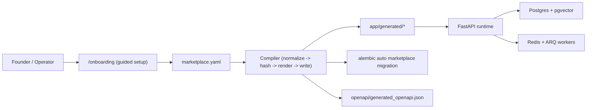

# Architecture

## Intent

Cosolvent is not a generic CRUD scaffold. It is a thin-market engineering runtime:

- keep heterogeneity in profiles,
- still make discovery work,
- reduce trust friction,
- make onboarding non-technical,
- compile configuration into deterministic deployable assets.

The operating thesis comes from `WHITEPAPER.md`.

## System Overview

## Core Runtime Shape

- `app/main.py`: app factory and router registration.
- `app/core/`: settings, DB sessions, middleware, dependencies.
- `app/modules/*`: domain modules (`router -> service -> repository`).
- `app/engine/*`: schema, permission, and visibility engines.
- `app/workers/*`: async indexing, document processing, email tasks.

## Setup and Compiler Runtime

- `app/setup_app.py`: setup-only app for onboarding and generation workflows.
- `app/modules/setup/router.py`: `/onboarding` and setup APIs.
- `app/compiler/*`: deterministic config compiler.

Compiler responsibilities:
1. Validate and canonicalize marketplace config.
2. Produce stable `spec_hash`.
3. Render managed generated artifacts.
4. Prune stale managed outputs via manifest.
5. Optionally export `.tar.gz` package for repo handoff.

## Managed Zones

Generated outputs are restricted to managed zones:

- `app/generated/*`
- `alembic/versions/auto_marketplace_*.py`
- `openapi/generated_openapi.json`
- `generated/manifest.json`
- `exports/*.tar.gz` (optional)

No handwritten files outside these zones are overwritten during regeneration.

## API Compatibility Strategy

Generic endpoints remain stable for compatibility:
- `/api/profiles/{type_slug}/...`

Generated role alias endpoints are additive:
- `/api/roles/{role_slug}/register`
- `/api/roles/{role_slug}/draft`
- `/api/roles/{role_slug}/me`
- `/api/roles/{role_slug}/{profile_id}`

`app/main.py` loads generated routers when present.

## Data Strategy

Primary storage:
- Postgres operational tables (`users`, `profiles`, `applications`, `conversations`, etc.)
- pgvector-backed search tables (`profile_vectors`, `ai_document_chunks`)

Generated migration materializes marketplace metadata tables:
- `marketplace_roles`
- `marketplace_role_permissions`
- `marketplace_onboarding_rules`
- `marketplace_communication_rules`
- `marketplace_profile_field_defs`
- `marketplace_builds`

This preserves runtime flexibility while keeping generated marketplace intent queryable and auditable.

## Whitepaper-to-System Mapping

| Thin-market force | Practical runtime response |
| --- | --- |
| Opacity & friction | Guided onboarding + deterministic schemas + alias routes |
| Information density | Dynamic profile models + visibility engine + vector retrieval |
| Temporal distance | Async workflows via Redis/ARQ + notifications |
| Trust & safety | Approval workflows, admin oversight, structured communication rules |
| Cognitive bandwidth | Guided onboarding with presets and reviewed generation output |

## CI Contract

- Config source: `marketplace.yaml`
- Drift gate: `python -m cli compile --check --config marketplace.yaml --mode mvp`
- CI fails when generated artifacts are stale against config/compiler state.
