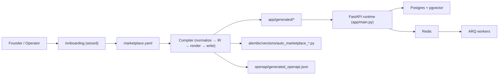

# Architecture

Cosolvent is a config-driven marketplace runtime, not a generic CRUD scaffold. This page covers the system design, data flow, and key architectural decisions.

## Intent

The platform solves a specific engineering problem: how to build a marketplace backend that:
- keeps heterogeneous profile data while making discovery work,
- enforces onboarding and trust rules without custom coding,
- compiles configuration into deterministic, deployable artifacts,
- stays inspectable — behavior is traceable to config, not scattered across code.

## System Overview



## System Layers

### Core (`app/core/`)

- `config.py` — pydantic-settings `Settings` class. Reads from `.env`.
- `marketplace_config.py` — `MarketplaceConfig` Pydantic model. The schema for `marketplace.yaml`.
- `database.py` — SQLAlchemy async engine + MongoDB-compatible collection API over JSONB tables. Startup creates all tables and indexes.
- `dependencies.py` — FastAPI dependency functions (`get_current_user`, `require_admin`, etc.).
- `middleware.py` — request logging, CORS.

### Modules (`app/modules/`)

Each module follows the pattern: **router** (HTTP layer) → **service** (logic) → **repository** (database). Schemas define request/response models.

Modules: `auth`, `profiles`, `files`, `communication`, `discovery`, `notifications`, `ai`, `admin`, `setup`.

### Engines (`app/engine/`)

Three stateless engines interpret `MarketplaceConfig` at runtime:
- **Permission engine** — checks `can_*` flags and conversation initiation rules
- **Schema engine** — generates Pydantic models from profile schemas; computes completeness
- **Visibility engine** — filters profile fields based on viewer tier

Engines have no database access. They are pure functions over config + input data.

### Compiler (`app/compiler/`)

The offline pipeline that converts `marketplace.yaml` into deployable artifacts. Runs via CLI or the setup API. Four stages: normalize → IR → render → write.

### Workers (`app/workers/`)

ARQ background tasks: document indexing, profile vector indexing, email sending. Share `.env` and DB config with the API but run as a separate process.

## Setup vs. Runtime Separation

Two separate FastAPI apps exist:

| App | File | Purpose |
|-----|------|---------|
| Main API | `app/main.py` | Production runtime. Serves marketplace API + WebSockets. |
| Setup app | `app/setup_app.py` | Onboarding only. Serves wizard UI and compilation endpoints. |

These **never run at the same time**. The setup app is used during initial configuration; the main API runs in production. This separation keeps setup dependencies out of the production image.

## Data Strategy

### Operational tables (JSONB document model)

```
CREATE TABLE users (
    id UUID PRIMARY KEY,
    data JSONB NOT NULL,
    created_at TIMESTAMPTZ,
    updated_at TIMESTAMPTZ
)
```

All business fields live in `data`. The database layer (`app/core/database.py`) exposes a MongoDB-compatible API (`find`, `find_one`, `insert_one`, `update_one`, etc.) over these tables. This gives document flexibility while retaining Postgres transactions and indexes.

### Vector tables

Dedicated relational tables for pgvector:
- `ai_document_chunks` — RAG document embeddings (1536 or 768 dimensions depending on provider)
- `profile_vectors` — profile discovery embeddings

### Generated marketplace metadata tables

The compiler generates an Alembic migration that creates and idempotently seeds:
- `marketplace_roles`, `marketplace_role_permissions`
- `marketplace_onboarding_rules`, `marketplace_communication_rules`
- `marketplace_profile_field_defs`, `marketplace_builds`

These tables make marketplace configuration queryable and auditable at the database level.

## Managed Zones

The compiler writes only to:

```
app/generated/*
alembic/versions/auto_marketplace_*.py
openapi/generated_openapi.json
generated/manifest.json
exports/*.tar.gz
```

No user code outside these zones is touched during regeneration. This is enforced by the writer — it checks every output path against the managed zone list before writing.

## API Compatibility Strategy

Two parallel route sets exist after generation:

**Generic (stable):**
```
/api/profiles/{type_slug}/register
/api/profiles/{type_slug}/me
...
```

**Generated role aliases (additive):**
```
/api/roles/producer/register
/api/roles/producer/me
...
```

Generic routes remain stable for API clients that don't know your specific role names. Generated aliases expose configured role names as first-class API paths. `app/main.py` loads `app/generated/role_alias_router.py` when present.

## Config → Runtime Flow

At startup, `app/main.py` loads `marketplace.yaml` via `MarketplaceConfig`. This instance is injected into:
- Dependency functions (available to every request handler)
- Permission engine (checks `can_*` flags)
- Schema engine (validates profile field data)
- Visibility engine (filters fields by viewer tier)
- Discovery module (respects `searchable_types`, `filter_fields`, AI settings)

No runtime behavior changes without a restart (after config edit + recompile).

## CI Contract

```bash
python -m cli compile --check --config marketplace.yaml --mode mvp
```

CI fails when:
- generated files are missing
- file contents drift from current config
- stale managed files remain
- manifest `spec_hash` does not match

This gate runs on every PR. See [Testing](testing.md) for the full CI gate.

## Whitepaper → System Mapping

| Thin-market force | Runtime response |
|-------------------|-----------------|
| Opacity & friction | Guided onboarding + deterministic schemas + alias routes |
| Information density | Dynamic profile models + visibility engine + vector retrieval |
| Temporal distance | Async workflows via Redis/ARQ + notifications |
| Trust & safety | Approval workflows + admin oversight + structured communication rules |
| Cognitive bandwidth | Guided onboarding with presets + generation review |

## See Also
- [Modules](modules.md) — every module in detail
- [Compiler](compiler.md) — the generation pipeline
- [Engines](engines.md) — permission, schema, visibility
- [Data Models](data-models.md) — all DB tables and schemas

---

[← Getting Started](getting-started.md) · [Modules →](modules.md)
