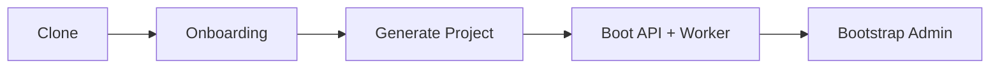

## Quick Start (Recommended: Docker)

Cosolvent is designed for thin markets where counterparties exist but still fail to transact reliably.

Use this guide when you want the fastest path from clone to a running, generated marketplace backend.



### 1. Clone

```bash
git clone https://github.com/DeeperPoint/cosolvent-beta.git
cd cosolvent-beta
```

### 2. Run setup onboarding first

```bash
make setup-up
```

Open `http://localhost:18080/onboarding`, then:

1. configure marketplace settings,
2. save to `marketplace.yaml`,
3. click `Generate Project`.

### 3. Start full stack

```bash
API_HOST_PORT=18000 docker compose up -d --build
python scripts/wait_for_http.py --url http://localhost:18000/api/health --timeout 180
```

The API is available at:

- API: `http://localhost:18000`
- Swagger docs: `http://localhost:18000/docs`

### 4. Bootstrap first admin

```bash
curl -X POST http://localhost:18000/api/auth/bootstrap \
  -H "Content-Type: application/json" \
  -d '{"email":"admin@example.com","password":"ChangeMe123!"}'
```

### 5. Optional config validation / compile-check

```bash
python -m cli validate marketplace.example.yaml
python -m cli compile --check --config marketplace.yaml --mode mvp
```

### 6. Stop stack

```bash
docker compose down -v
```

## Local Development (Without Docker)

### 1. Prerequisites

- Python `3.11+`
- Postgres `15+` with `pgvector` enabled
- Redis

### 2. Create virtual environment + install

```bash
python3 -m venv .venv
source .venv/bin/activate
pip install -e ".[dev]"
```

### 3. Configure environment

```bash
cp .env.example .env
```

Minimum required values for core flows:

- `POSTGRES_DSN` (or `POSTGRES_HOST/PORT/DB/USER/PASSWORD`)
- `REDIS_URL`
- `SESSION_SECRET`
- `MARKETPLACE_CONFIG_PATH`

### 4. Create marketplace config

Wizard:

```bash
python -m cli wizard -o marketplace.yaml
```

Preset:

```bash
python -m cli wizard --preset agriculture -o marketplace.yaml
# or
python -m cli wizard --preset professional_services -o marketplace.yaml
```

From example:

```bash
cp marketplace.example.yaml marketplace.yaml
```

Validate:

```bash
python -m cli validate marketplace.yaml
python -m cli compile --config marketplace.yaml --mode mvp
```

### 5. Run API + worker

API:

```bash
uvicorn app.main:app --reload --host 0.0.0.0 --port 8000
```

Worker:

```bash
arq app.workers.settings.WorkerSettings
```

Local URLs:

- API: `http://localhost:8000`
- Swagger docs: `http://localhost:8000/docs`

## Running Tests

```bash
# Lint
ruff check app cli tests scripts

# Unit
pytest tests/unit -q

# Integration (requires running stack)
RUN_INTEGRATION=1 INTEGRATION_BASE_URL=http://localhost:18000 pytest tests/integration -q

# Local full-stack E2E (requires running stack)
RUN_E2E=1 E2E_BASE_URL=http://localhost:18000 pytest tests/e2e/test_local_full_stack.py -q

# Live-provider E2E (only when provider keys are present)
RUN_LIVE_E2E=1 E2E_BASE_URL=http://localhost:18000 pytest tests/e2e/test_live_providers.py -q -rs
```

## Troubleshooting

### Port already in use

```bash
API_HOST_PORT=19000 docker compose up -d --build
```

Then use `http://localhost:19000`.

### DB extension error on startup

Confirm the target Postgres instance supports and allows:

```sql
CREATE EXTENSION IF NOT EXISTS vector;
```

### Worker not processing

- `docker compose logs -f worker`
- Verify Redis connectivity and that worker process is running.

### AI endpoints return `503`

Expected when provider keys are missing. Non-AI core flows still run.
