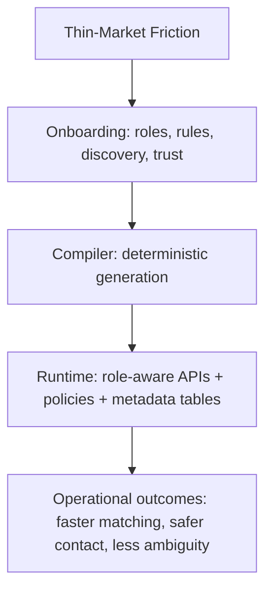

# Thin-Market Principles

This project exists for a specific class of marketplace problem:

Markets where buyers and sellers exist, but useful trades still fail repeatedly.

## The Core Failure Pattern

In thin markets, intent is present but execution is fragile:

- participants are sparse or fragmented,
- information is complex and hard to compare,
- trust is expensive to establish,
- timing between counterparties rarely aligns,
- regulatory and workflow friction block momentum.

From the whitepaper:

`Market function requires: Desire > Opacity + Friction`

Cosolvent focuses on the right side of that equation.

## Product Philosophy

1. Keep real-world complexity, do not flatten it away.
2. Make configuration operator-friendly, not engineer-only.
3. Compile decisions into deterministic runtime artifacts.
4. Keep behavior inspectable (metadata tables, OpenAPI snapshots, manifest).
5. Treat trust as infrastructure, not marketing copy.

## How the Platform Responds

## Engineering Stance

- Generic endpoints remain for compatibility.
- Generated alias endpoints make configured roles first-class.
- Shared operational model remains stable; generated metadata records marketplace intent.
- Regeneration is constrained to managed zones for safety.

## What "Good" Looks Like

A founder can:
1. clone the repo,
2. complete guided onboarding,
3. generate and boot the stack,
4. onboard users,
5. execute approve/search/chat flows without custom coding.

That is the baseline for thin-market MVP viability in this project.
